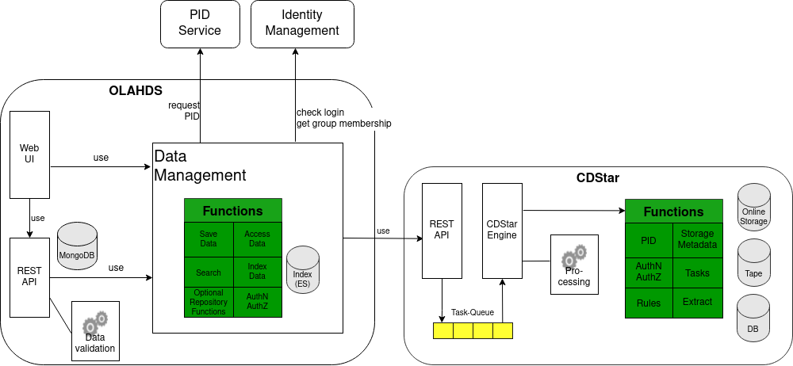

# OLA-HD back-end
[OLA-HD](https://ocr-d.de/en/phase3#ola-hd-service--a-generic-service-for-long-term-archiving-of-historical-prints) - A generic Service for the long-term Archiving of Historic Prints

This is the core of the OLA-HD project. OLA-HD is to archive, export and search [OCR-D-ZIP-Files](https://ocr-d.de/en/spec/ocrd_zip). It is written using Spring Boot framework. It contains Elasticsearch and Indexer tool, IIIF Manifest Builder for indexing and searching.

[rem]: BEGIN-MARKDOWN-TOC
* [Installation and startup](#installation-and-startup)
* [System overview](#system-overview)
* [OLA-HD API usage](#ola-hd-api-usage)
    * [Import a file](#import-a-file)
    * [Import a new version of a work](#import-a-new-version-of-a-work)
    * [Full-text search](#full-text-search)
    * [Search by meta-data](#search-by-meta-data)
    * [Quick export](#quick-export)
    * [Full export request](#full-export-request)
    * [Full export](#full-export)
* [Search and indexing: Elasticsearch, Indexer tool, IIIF Manifest Builder](#search-and-indexing-elasticsearch-indexer-tool-iiif-manifest-builder)
    * [Short explanation](#short-explanation)
    * [Data and control flow](#data-and-control-flow)
    * [How to build/install/run  (Redis, ES, Kibana, Indexer, Web-Notifier)](#how-to-buildinstallrun--redis-es-kibana-indexer-web-notifier)
        * [Build all services](#build-all-services)
        * [Start all services](#start-all-services)
    * [How to use (Redis, ES, Kibana, Indexer, Web-Notifier)](#how-to-use-redis-es-kibana-indexer-web-notifier)
        * [Redis](#redis)
        * [Elasticsearch](#elasticsearch)
        * [Kibana](#kibana)
        * [Indexer](#indexer)
        * [Web-Notifier](#web-notifier)

[rem]: END-MARKDOWN-TOC

## Installation and startup
- tested on Debian/Ubuntu
- requirements:
    - docker
    - docker-compose
- `git clone https://github.com/subugoe/olahd_backend.git`
- `cd olahd_backend`
- create `.env`-File:
```
MONGO_INITDB_ROOT_USERNAME=test
MONGO_INITDB_ROOT_PASSWORD=testtest
MONGO_INITDB_DATABASE=ola-hd

OLA_HD_EXTERNAL_PORT=8080
OLA_HD_PORT=8080
OLA_HD_MIN_MEMORY=6G
OLA_HD_MAX_MEMORY=6G
```
- ensure `vm.max_map_count` is at least 262144, required for Elasticsearch. Can be tested with `sudo sysctl vm.max_map_count`. Can be set (until next boot) with `sudo sysctl -w vm.max_map_count=262144` or with /etc/sysctl.d
- create config:
    - `cp -n src/main/resources/application.properties.template src/main/resources/application.properties`
    - `cp -n src/main/resources/application-development.properties.template src/main/resources/application-development.properties`
- Start service: `sudo docker-compose -f docker-compose.base.yaml -f docker-compose.local.yaml up -d`

## System overview



* **Web UI**: [OLA-HD front-end](https://github.com/subugoe/olahd_user_frontend).
* **REST API**
    * **Import API**: an endpoint where users call when they want to import data to the system. This
      component will call the PID Service to get a Persistent Identifier (PID) for the imported
      data, save some information to the database, and send the data to the Archive Manager.
    * **Export API**: this API allows users to download data from the system.
    * **Quick export**: users can quickly get data stored on hard drive. Authentication is not
       required.
    * **Full export**: this component is responsible for delivering data on tape to users. Users
       must provide valid credentials to use this component.
    * **Full export request**: when users request data stored on tapes, first the system must copy
       the data to hard drive. This process takes a lot of time (hours, or even days). Therefore,
       before being able to download a full export, users have to make a full export request to
       trigger the copy process. After that, users can try downloading the data. If the copy
       process is not finished yet, users will get an error response. A copy is available on hard
       drive for some time, depending on the configuration. After that time, the system will delete
       that copy.
    * **Search API**: users can call this endpoint to search for data.
* **PID Service**: we use [GWDG PID Service](https://www.gwdg.de/application-services/persistent-identifier-pid).
  Each PID is a handle and can be resolved using a service from [Handle.Net](https://hdl.handle.net/).
* **Identity Management**: currently, users are authenticated against [GWDG OpenLDAP][2]. Users have
  to provide proper credentials to import data to the system or to download full copy of the data.
  Since this is the REST API, the expected users are other systems. However, human users are also
  possible.
* **Archive manager (CDStar)**: the service which facilitates the communication with the storage.
  This service is called
  [CDSTAR](https://info.gwdg.de/dokuwiki/doku.php?id=en:services:storage_services:gwdg_cdstar:start)
  and maintained by GWDG. When data is imported, everything will be stored on tapes. To provide
  quick access to users, some data are copied to hard drive. In the current configuration, the
  system does not store TIFF images on hard drive.
* **MongoDB**: the database of the back-end. It stores all import and export information.

## OLA-HD API usage
### Import a file
To import a file, send a `POST` request to the `/bag` endpoint.
This endpoint does not open to public.
Therefore, authentication is needed to access it.
```
curl -X POST \
     http://your.domain.com/bag \
     -u <user:password> \
     -H 'content-type: multipart/form-data' \
     -F file=@<path-to-file>
```
In the response, a PID is returned in the `Location` header.

### Import a new version of a work
To import a new version, in addition to the `.zip` file, a PID of a previous work version must be submitted as well.
```
curl -X POST \
     http://your.domain.com/bag \
     -u <user:password> \
     -H 'content-type: multipart/form-data' \
     -F file=@<path-to-file>
     -F prev=<PID-previous-version>
```

### Full-text search
To perform a search, send a `GET` request to the `/search` endpoint.
The query is provided via the `q` parameter, e.g. `/search?q=test`
```
curl -X GET http://your.domain.com/search?q=test
```

### Search by meta-data
Besides full-text search, users can also search by meta-data.
Currently, OLA-HD supports meta-data from [Dublin Core](https://www.dublincore.org/specifications/dublin-core/dces/).
To use it, prepend the meta-data with `dc`, e.g. `/search?q=dcCreator:John`

**IMPORTANT**: a PID always contains a forward slash, which is a special character.
For that reason, search by identifier (PID) can only be perform as a phrase search and the double quote must be encoded as `%22`.
```
curl -X GET http://your.domain.com/search?q=dcIdentifier:%22your-identifier%22
```

### Quick export
Data stored on hard drives can be quickly and publicly exported.
To do so, send a `GET` request to the `/export` endpoint.
The `id` must be provided as a URL parameter.
```
curl -X GET http://your.domain.com/export?id=your-id --output export.zip
```

### Full export request
To initiate the data movement process from tapes to hard drives, a full export request must be made.
In the request, the identifier of the file is specified.
Then, the archive manager will move this file from tapes to hard drives.
This process takes quite long, hours or days, depending on the real situation.
To send the request, simply send a `GET` request to the `export-request` endpoint with the `id`.
```
curl -X GET http://your.domain.com/export-request?id=your-id
```

### Full export
After the export request was successfully fulfilled, the full export can be made.
```
curl -X GET http://your.domain.com/full-export?id=your-id --output export.zip
```


## Search and indexing: Elasticsearch, Indexer tool, IIIF Manifest Builder

### Short explanation
The Indexing tool loads METS files, interprets the structures, derives bibliographic and structural metadata and creates json based index documents. The logical structure and metadata is mapped to the logical index. Each logical structure element in METS corresponds to a logical index document. The same applies to the physical descriptions in the METS, except that these are mapped to physical index documents and also contain the full text.

IIIF Manifests will be created from the index, there is no direct transformation from METS to manifest. This has several reasons:
* Simplicity: METS is only analyzed in one place to reduce support and maintenance.
* Flexibility of METS: There are different places where to describe e.g. the title, the author and so on and one has to check all the different places. Generic tools doesn't do this and possibly lost information.
* Control about which metadata goes in the info panel.
* Our viewer (TIFY) currently does not support IIIF Presentation v. 3.0.
* Bad quality of existing mapping tools.

### Data and control flow
The data and control flow starts with an indexing request on the web-notifier service. The web-notifier creates an indexing job for this and push it to the indexing queue (Redis queue "indexer"). The indexer service listening on this queues and blocks until a new message (job) is in the queue. If the indexer get a new job, it downloads the METS, parses the structures and creates the index documents. As part of the parsing it also downloads the full-texts and adds these to the physical index documents to support full-text search.

### How to build/install/run  (Redis, ES, Kibana, Indexer, Web-Notifier)
This describes a "local" view, which means the containers are linked via docker-compose. For access from external locations we must add some kind of reverse proxy (e.g. HAProxy) to accept and route requests in a secure manner.

We have different docker-compose files for a local and also for a cluster/VM environment. The configuration use specific configuration variables (see folder cfg/).

#### Build all services
```
project_root$> docker-compose -f docker-compose.base.yaml -f docker-compose.local.yaml -f docker-compose.kibana.yaml build
```

#### Start all services
```
project_root$> docker-compose -f docker-compose.base.yaml -f docker-compose.local.yaml -f docker-compose.kibana.yaml up -d
```

### How to use (Redis, ES, Kibana, Indexer, Web-Notifier)
#### Redis
You can access Redis via:

```
1) http://<host>:8442
2) http://redis:6379   (from linked containers)
```

#### Elasticsearch
You can access Elasticsearch via:

```
1) http://<host>:9200
2) http://search:9200   (from linked containers)
```

The Kibana configuration uses 2), you can see it e.g. in:
```
<project>/docker/kibana/config/kibana.yml
```

#### Kibana
Open the Kibana front-end in your browser (http://localhost:5601) and click on "Dev tools". Sample query:

```
GET /_search
{
  "size":5,
  "query": {
    "match_all": {}
  },
  "_source": ["*"]
}
```

#### Indexer
The indexer fetches new jobs from a Redis queue ("indexer"), which were previously enqueued there by the web-notifier. The indexer runs as a background process.


#### Web-Notifier
The web-notifier creates service endpoints that supports requests for the creation of indexing job, IIIF manifest creation jobs or for citation jobs creation. Below is an example test for creating an indexing job:

```
POST http://<host>:<port>/api/indexer/jobs HTTP/1.1
Accept: */*
Cache-Control: no-cache
Content-Type: application/json

{
    "document": "PPN4711",
    "context": "ocrd",
    "product": "vd18"
}
```
